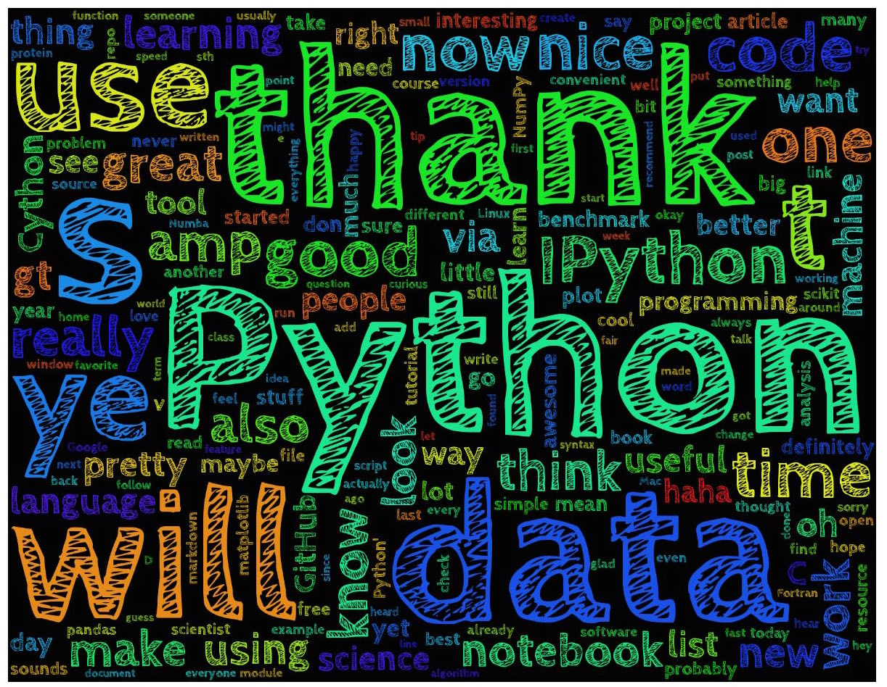

# 100DaysOfMLCode
The creation of this repository was inspired by [Siraj Raval's challenge](https://www.linkedin.com/feed/update/urn:li:activity:6420525903968825344/) to code machine learning for at least an hour everyday for 100 days.
# Day 1

* Crash course of Data Science and ML with Python
* Article link:(https://hackernoon.com/10-ways-to-make-python-a-dangerous-language-for-data-science-6b88566ac040)
* Repository : (https://github.com/harunshimanto/Python-The-Dangerous-Tool-For-ML-Data-Science)
